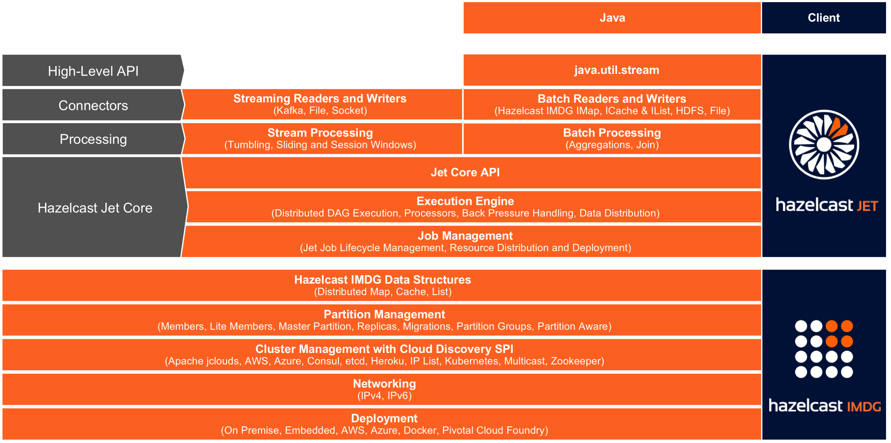

Hazelcast Jet is a distributed data processing engine, built for
high-performance batch and stream processing. It reuses some features
and services of [Hazelcast In-Memory Data
Grid](http://www.hazelcast.org) (IMDG), but is otherwise a separate
product with features not available in the IMDG.

Jet also enriches the IMDG data structures such as `IMap` and `IList`
with a distributed implementation of
[`java.util.stream`](https://docs.oracle.com/javase/8/docs/api/java/util/stream/package-summary.html).

With Hazelcast’s IMDG providing storage functionality, Hazelcast
Jet performs parallel execution to enable data-intensive applications to
operate in near real-time. Using directed acyclic graphs (DAG) to model
relationships between individual steps in the data processing pipeline,
Hazelcast Jet can execute both batch and stream-based data processing
applications. Jet handles the parallel execution using the _green
thread_ approach to optimize the utilization of the computing resources.

Breakthrough application speed is achieved by keeping both the
computation and data storage in memory. The embedded Hazelcast IMDG
provides elastic in-memory storage and is a great tool for storing the
results of a computation or as a cache for datasets to be used during
the computation. Extremely low end-to-end latencies can be achieved this
way.

It is extremely simple to use -- in particular, Jet can be fully 
embedded for OEMs and for Microservices – making it is easier for
manufacturers to build and maintain next generation systems. Also,
Jet uses Hazelcast discovery for finding the members in the cluster, 
which can be used in both on-premise and cloud environments.

## Architecture Overview

## The Data Processing Model

Hazelcast Jet provides high performance in-memory data processing by
modeling the computation as a _Directed Acyclic Graph (DAG)_ where
vertices represent computation and edges represent data connections. A
vertex receives data from its inbound edges, performs a step in the
computation, and emits data to its outbound edges. A single vertex's
computation work is performed in parallel by many instances of the
`Processor` type around the cluster.

One of the major reasons to divide the full computation task into
several vertices is _data partitioning_: the ability to split the data
stream traveling over an edge into slices which can be processed
independently of each other. To make this work, a function must be
defined which computes the _partitioning key_ for each item and makes
all related items map to the same key. The computation engine can then
route all such items to the same processor instance. This makes it easy
to parallelize the computation: each processor will have the full
picture for its slice of the entire stream.

Edges determine how the data is routed from individual source processors
to individual destination processors. Different edge properties offer
precise control over the flow of data.

## Clustering and Discovery

Hazelcast Jet typically runs on several machines that form a cluster but
it may also run on a single JVM for testing purposes.
There are several ways to configure the members for discovery, explained
in detail in the [Hazelcast IMDG Reference
Manual](http://docs.hazelcast.org/docs/latest/manual/html-single/index.html#setting-up-clusters).

## Members and Clients

A Hazelcast Jet _instance_ is a unit where the processing takes place.
There can be multiple instances per JVM, however this only makes sense
for testing. An instance becomes a _member_ of a cluster: it can join
and leave clusters multiple times during its lifetime. Any instance can
be used to access a cluster, giving an appearance that the entire
cluster is available locally.

On the other hand, a _client instance_ is just an accessor to a cluster
and no processing takes place in it.

## Relationship with Hazelcast IMDG

Hazelcast Jet leans on [Hazelcast IMDG](http://www.hazelcast.org) for
cluster formation and maintenance, data partitioning, and networking.
For more information on Hazelcast IMDG, see the [latest Hazelcast
Reference Manual](http://docs.hazelcast.org/docs/latest/manual/html-single/index.html).

As Jet is built on top of the Hazelcast platform, there is a tight
integration between Jet and IMDG. A Jet job is implemented as a
Hazelcast IMDG proxy, similar to the other services and data structures
in Hazelcast. The Hazelcast Operations are used for different actions
that can be performed on a job. Jet can also be used with the Hazelcast
Client, which uses the Hazelcast Open Binary Protocol to communicate
different actions to the server instance.

### Reading from and Writing to Hazelcast Distributed Data Structures

Jet embeds Hazelcast IMDG. Therefore, Jet can use Hazelcast IMDG maps,
caches and lists on the embedded cluster as sources and sinks of data
and make use of data locality. A Hazelcast `IMap` or `ICache` is
distributed by partitions across the cluster and Jet members are able to
efficiently read from the Map or Cache by having each member read just
its local partitions. Since the whole `IList` is stored on a single
partition, all the data will be read on the single member that owns that
partition. When using a map, cache or list as a Sink, it is not possible
to directly make use of data locality because the emitted key-value pair
may belong to a non-local partition. In this case the pair must be
transmitted over the network to the member which owns that particular
partition.

Jet can also use any remote Hazelcast IMDG instance via Hazelcast IMDG
connector.

## Fault Tolerance

A job that processes an infinite stream never completes and cannot be
restarted from the beginning if it fails. For such a job, fault
tolerance is essential: the engine must be able to detect a failure,
recover from it, and resume processing without data loss.

Hazelcast Jet achieves fault tolerance by making a snapshot of the
internal processing state at regular intervals. If a member of the
cluster fails while a job is running, Hazelcast Jet will detect this and
restart the job on the new cluster topology. It will restore its
internal state from the snapshot and tell the source to start sending
data from the last "committed" position (where the snapshot was taken).

## Elasticity

Hazelcast Jet supports the scenario where a new member joins the cluster
while a job is running. Currently the ongoing job will not be re-planned
to start using the member, though; this is on the roadmap for a future
version. The new member can also leave the cluster while the job is
running and this won't affect its progress.

One caveat is the special kind of member allowed by the Hazelcast IMDG:
a _lite member_. These members don't get any partitions assigned to them
and will malfunction when attempting to run a DAG with partitioned
edges. Lite members should not be allowed to join a Jet cluster.

## The DAG

At the core of Jet is the distributed computation engine based on the
paradigm of a **directed acyclic graph** (DAG):

### Vertex 

The vertex represents a stage in the pipeline of the distributed
computation job. The three main categories of vertex are the source, the
sink, and the computational vertex. Jet doesn't make a formal
distinction between these; for example, any vertex lacking inbound edges
acts as a source. Internally it is implemented in terms of the same
API as a sink or a computational vertex.

A source can be distributed, which means that on each member of
the Jet cluster a different slice of the full data set will be read.
Similarly, a sink can also be distributed so each member can write a
slice of the result data to its local storage. _Data partitioning_ is
used to route each slice to its target member. Examples of distributed
sources supported by Jet are HDFS files and Hazelcast's `IMap`, `ICache`
and `IList`.

The executable code of a vertex is implemented in a subtype of the
`Processor` interface. To run a job, Jet creates several instances of
this type on each cluster member. It routes a part of the complete data
stream to each processor and on the output side it collects the partial
data streams from each processor, reshuffles the data as configured on
the edge, and routes to downstream processors.

### Edge 

The edge transfers data from one vertex to the next and contains the
logic that decides which target processor an item should be routed to.
This could be guided by the partitioning logic, or could be one of the
other choices like broadcast or pooled unicast. An edge may be
configured to keep the data within a member, routing only to local
processors. This allows us to design DAGs which optimally balance
network and memory usage.

## Running a Jet job

After a `Job` is created, Jet replicates the DAG to the whole Jet
cluster and executes it in parallel on each member.

Execution is done on a user-configurable number of threads which use
work stealing to balance the amount of work being done on each thread.
Each worker thread has a list of tasklets it is in charge of and as
tasklets complete at different rates, the remaining ones are moved
between workers to keep the load balanced.

Each instance of a `Processor` is wrapped in one tasklet which is
repeatedly executed until it reports it is done. A vertex with a
parallelism of 8 running on 4 members would have a total of 32 tasklets
running at the same time. Each member will have the same number of
tasklets running.

When a request to execute a Job is made, the corresponding DAG and
additional resources are deployed to the Jet cluster. An execution plan
for the DAG is built on each member, which creates the associated
tasklets for each Vertex and connects them to their inputs and outputs.

Jet uses Single Producer/Single Consumer ringbuffers to transfer the
data between processors on the same member. They are data-type agnostic,
so any data type can be used to transfer the data between vertices.

Ringbuffers, being bounded queues, introduce natural backpressure into
the system; if a consumer’s ringbuffer is full, the producer will have
to back off until it can enqueue the next item. When data is sent to
another member over the network, there is no natural backpressure, so
Jet uses explicit signaling in the form of adaptive receive windows.
