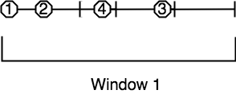

Continuing our deep dive into Jet's fundamentals we shall now move on to
infinite stream processing. The major challenge in batch jobs was properly
parallelizing/distributing a "group by key" operation. To solve it we
introduced the idea of partitioning the data based on a formula that takes
just the grouping key as input and can be computed independently on any
member, always yielding the same result. In the context of infinite stream
processing we have the same concern and solve it with the same means, but
we also face some new challenges.

## Stream Skew

We
[already introduced](Work_with_Jet/Finite_vs_Infinite_Stream_Processing#page_Time+Ordering+and+the+Watermark)
the concept of the watermark and how it imposes
order onto a disordered data stream. Items arriving out of order aren't
our only challenge; modern stream sources like Kafka are partitioned and
distributed so "the stream" is actually a set of independent substreams,
moving on in parallel. Substantial time difference may arise between
events being processed on each one, but our system must produce coherent
output as if there was only one stream. We meet this challenge by
coalescing watermarks: as the data travels over a partitioned/distributed
edge, we make sure the downstream processor observes the correct watermark
value, which is the least of watermarks received from the contributing
substreams.

## Sliding and Tumbling Window

Many quantities, like "the current rate of change of a price" require you
to aggregate your data over some time period. This is what makes the
sliding window so important: it tracks the value of such a quantity in
real time.

Calculating a single sliding window result can be quite computationally
intensive, but we also expect it to slide smoothly and give a new result
often, even many times per second. This is why we gave special attention
to optimizing this computation. 

We optimize especially heavily for those aggregate operations that have
a cheap way of combining partial results and even more so for those
which can cheaply undo the combining. For cheap combining you have to
express your operation in terms of a commutative and associative (CA for
short) function; to undo a combine you need the notion of "negating" an
argument to the function. A great many operations can be expressed
through CA functions: average, variance, standard deviation and linear
regression are some examples. All of these also support the undoing
(which we call _deduct_). The computation of extreme values (min/max) is
an example that has CA, but no good notion of negation and thus doesn't
support deducting.

This is the way we leverage the above properties: our sliding window
actually "hops" in fixed-size steps. The length of the window is an
integer multiple of the step size. Under such a definition, the _tumbling_
window becomes just a special case with one step per window.

This allows us to divide the timestamp axis into _frames_ of equal length
and assign each event to its frame. Instead of keeping the event object,
we immediatly pass it to the aggregate operation's _accumulate_ primitive.
To compute a sliding window, we take all the frames covered by it and
combine them. Finally, to compute the next window, we just _deduct_ the
trailing frame and _combine_ the leading frame into the existing result.

Even without _deduct_ the above process is much cheaper than the most
naïve approach where you'd keep all data and recompute everything from
scratch each time. After accumulating an item just once, the rest of the
process has fixed cost regardless of input size. With _deduct_, the
fixed cost approaches zero.

### Example: 30-second Window Sliding by 10 Seconds

We'll now illustrate the above story with a specific example: we'll
construct a 30-second window which slides by 10 seconds (i.e., three
steps per window). The aggregate operation is to simply count the number
of events. In the diagrams we label the events as _minutes:seconds_.
This is the outline of the process:

1. Throw each event into its "bucket" (the frame whose time interval it
belongs to).
2. Instead of keeping the items in the frame, just keep the item count.
3. Combine the frames into three different positions of the sliding 
window, yielding the final result: the number of events that occurred 
within the window's timespan.

This would be a useful interpretation of the results: "At the time 1:30,
the 30-second running average was 8/30 = 0.27 events per second. Over
the next 20 seconds it increased to 10/30 = 0.33 events per second."

Keep in mind that the whole diagram represents what happens on just one
cluster member and for just one grouping key. The same process is going
on simultaneously for all the keys on all the members.

### Two-stage aggregation

The concept of frame combining helps us implement two-stage aggregation
as well. In the first stage the individual members come up with their
partial results by frame and send them over a distributed edge to the
second stage, which combines the frames with the same timestamp. After
having combined all the partial frames from members, it combines the
results along the event time axis into the sliding window.

## Session Window

In the abstract sense, the session window is a quite intuitive concept:
it simply captures a burst of events. As soon as the gap between two
events exceeds the configured session timeout, the window closes.
However, because the Jet processor encounters events out of their
original order, this kind of window becomes quite tricky to compute.

The way Jet computes the session windows is easiest to explain in terms
of the _event interval_: the range
`[eventTimestamp, eventTimestamp + sessionTimeout]`.
Initially an event causes a new session window to be created, covering
exactly the event interval. 

A following event under the same key belongs to this window iff its
interval overlaps it. The window is extended to cover the entire
interval of the new event. 

    
If the event interval don't overlap, a new session window is created for
the new event.

The event may happen to belong to two existing windows if its interval
bridges the gap between them; in that case they are combined into one.

