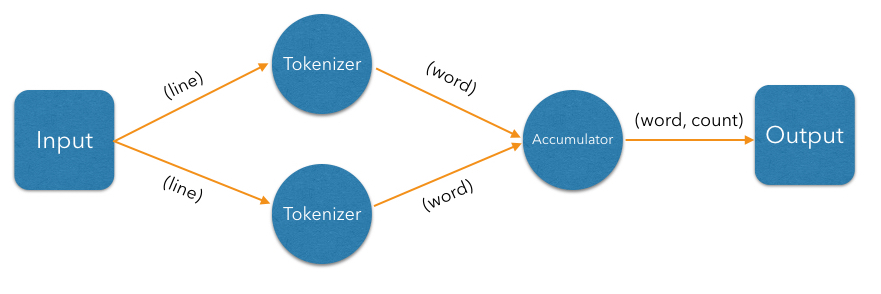
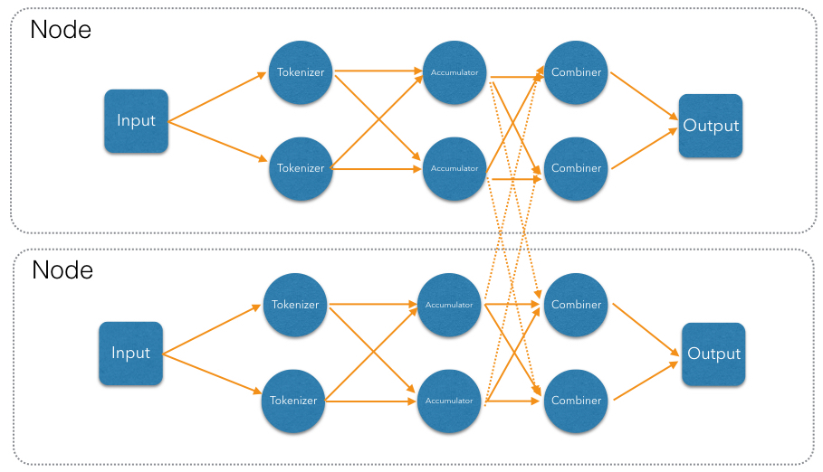

In this section we'll take a deep dive into the fundamentals of
distributed computing and Jet's specific take on it. We'll do this by
dissecting one specific problem: the Word Count. Starting from the single-threaded Java code that solves the problem for a basic data structure such as an `ArrayList`, we'll gradually move on to a formulation that allows us to solve it for a data source distributed over the whole cluster, efficiently making use of all the available CPU power. The section culminates with a display of Core API code that directly builds the DAG we designed.

Here is the single-threaded code that counts the words in a `List` of
lines of text:

```java
List<String> lines = ... // a pre-existing list
Map<String, Long> counts = new HashMap<>();
for (String line : lines) {
    for (String word : line.toLowerCase().split("\\W+")) {
        if (!word.isEmpty()) {
            counts.merge(word, 1L, (count, one) -> count + one);
        }
    }
}
```

To move us closer to how this computation is expressed in Jet, let's 
rewrite it in terms of the Java Streams API, still single-threaded:

```java
Map<String, Long> counts = 
    lines.stream()
         .flatMap(line -> Arrays.stream(line.toLowerCase().split("\\W+")))
         .filter(word -> !word.isEmpty())
         .collect(groupingBy(word -> word, counting()));
```

The Java Streams formulation gives us clear insight into the steps taken
to process each data item:

1. `lines.stream()`: read lines from the data source (we'll call this 
   the "source" step).
2. `flatMap()`+`filter()`: split each line into lowercase words,
   avoiding empty strings (the "tokenizer" step).
3. `collect()`: group equal words together and count them (the 
   "accumulator" step).

Our first move will be modeling the computation as a DAG. We'll start
with a single-threaded model and then make several transformation steps
to it to reach a parallelized, distributed one, discussing at each step
the concerns that arise and how to meet them.

Note that here we are describing a _batch_ job: the input is finite
and present in full before the job starts. Later on we'll present a
_streaming_ job that keeps processing an infinite stream forever,
transforming it into another infinite stream.

## Modeling Word Count in terms of a DAG

We can represent the steps outlined above as a DAG:


The simplest, single-threaded code (shown above) deals with each item as
it is produced: the outer loop reads the lines, the inner loop that runs
for each line deals with the words on that line, and inside the inner
loop we populate the result map with running counts.

However, just by modeling the computation as a DAG, we've split the work
into isolated steps with clear data interfaces between them. We can
perform the same computation by running a separate thread for each step. Roughly speaking, these are the snippets the threads would be executing:

```java
// Source thread
for (String line : readLines()) {
    emit(line);
}
```
```java
// Tokenizer thread
for (String line : receive()) {
    for (String word : line.toLowerCase().split("\\W+")) {
        if (!word.isEmpty()) {
            emit(word);
        }
    }
}
```    
```java
// Accumulator thread
Map<String, Long> counts = new HashMap<>();
for (String word : receive()) {
    counts.merge(word, 1L, (count, one) -> count + one);
}
// finally, when done receiving:
for (Entry<String, Long> wordAndCount : counts.entrySet()) {
    emit(wordAndCount);
}    
```

The source loop feeds the tokenizer loop over a concurrent queue, the 
tokenizer feeds the accumulator loop, and after the accumulator is done
receiving, it emits its results to the sink. Diagrammatically it looks
like this:


This transformation brought us a _pipelined_ architecture: while the tokenizer is busy with the regex work, the accumulator is updating the map using the data the tokenizer is done with; and the source and sink stages are pumping the data from/to the environment. Our design is now able to engage more than one CPU core and will complete that much sooner; however, we're still limited by the number of vertices. We'll be able utilize two or three cores regardless of how many are available. To move forward we must try to parallelize the work of each individual vertex.

Given that our input is an in-memory list of lines, the bottleneck
occurs in the processing stages (tokenizing and accumulating). Let's
first attack the tokenizing stage: it is a so-called "embarrassingly
parallelizable" task because the processing of each line is completely
self-contained. At this point we have to make a clear distinction
between the notions of _vertex_ and _processor_: there can be several
processors doing the work of a single vertex. Let's add another
tokenizing processor:



The input processor can now use all the available tokenizers as a pool
and submit to any one whose queue has some room.

The next step is parallelizing the accumulator vertex, but this is
trickier: accumulators count word occurrences so using them as a pool
will result in each processor observing almost all distinct words
(entries taking space in its hashtable), but the counts will be partial
and will need combining. The common strategy to reduce memory usage is
to ensure that all occurrences of the same word go to the same
processor. This is called "data partitioning" and in Jet we'll use a
_partitioned edge_ between the tokenizer and the accumulator:


As a word is emitted from the tokenizer, it goes through a "switchboard"
stage where it's routed to the correct downstream processor. To
determine where a word should be routed, we can calculate its hashcode
and use the lowest bit to address either accumulator 0 or accumulator 1.

At this point we have a blueprint for a fully functional parallelized
computation job which can max out all the CPU cores given enough
instances of tokenizing and accumulating processors. The next challenge
is making this work across machines.

For starters, our input can no longer be a simple in-memory list because
that would mean each machine processes the same data. To exploit the
cluster as a unified computation device, each cluster member must
observe only a slice of the dataset. Given that a Jet instance is also a
fully functional Hazelcast IMDG instance and a Jet cluster is also a
Hazelcast IMDG cluster, the natural choice is to pre-load our data into
an `IMap`, which will be automatically partitioned and distributed
across the members. Now each Jet member can just read the slice of data
that was stored locally on it.

When run in a cluster, Jet will instantiate a replica of the whole DAG
on each member. On a two-member cluster there will be two source
processors, four tokenizers, and so on. The trickiest part is the
partitioned edge between tokenizer and accumulator: each accumulator is
supposed to receive its own subset of words. That means that, for
example, a word emitted from tokenizer 0 will have to travel across the
network to reach accumulator 3, if that's the one that happens to own
it. On average we can expect every other word to need network transport,
causing both serious network traffic and serialization/deserialization
CPU load.

There is a simple trick we can employ to avoid most of this traffic,
closely related to what we pointed above as a source of problems when
parallelizing locally: members of the cluster can be used as a pool,
each doing its own partial word counts, and then send their results to a
combining vertex. Note that this means sending only one item per
distinct word. Here's the rough equivalent of the code the combining
vertex executes:

```java
// Combining vertex
Map<String, Long> combined = new HashMap<>();
for (Entry<String, Long> wordAndCount : receive()) {
    combined.merge(wordAndCount.getKey(), wordAndCount.getValue(), 
                    (accCount, newCount) -> accCount + newCount);
}
// finally, when done receiving:
for (Entry<String, Long> wordAndCount : combined.entrySet()) {
    emit(wordAndCount);
}    
```

As noted above, such a scheme takes more memory due to more hashtable entries on each member, but it saves network traffic (an issue we didn't have within a member). Given that memory costs scale with the number of
distinct keys (english words in our case), the memory cost is
more-or-less constant regardless of how much book material we process.
On the other hand, network traffic scales with the total data size so
the more material we process, the more we save on network traffic.

Jet distinguishes between _local_ and _distributed_ edges, so we'll use
a _local partitioned_ edge for `tokenize`->`accumulate` and a
_distributed partitioned_ edge for `accumulate`->`combine`. With this
move we've finalized our DAG design, which can be illustrated by the
following diagram:



## Implementing the DAG in Jet's Core API

Now that we've come up with a good DAG design, we can use Jet's Core API
to implement it. We start by instantiating the DAG class and adding the source vertex:

```java
DAG dag = new DAG();
Vertex source = dag.newVertex("source", SourceProcessors.readMap("lines"));
```

Note how we can build the DAG outside the context of any running Jet
instances: it is a pure POJO.

The source vertex will read the lines from the `IMap` and emit items of
type `Map.Entry<Integer, String>` to the next vertex. The key of the
entry is the line number, and the value is the line itself. The built-in
map-reading processor will do just what we want: on each member it will
read only the data local to that member.

The next vertex is the _tokenizer_, which does a simple "flat-mapping"
operation (transforms one input item into zero or more output items).
The low-level support for such a processor is a part of Jet's library,
we just need to provide the mapping function:

```java
// (lineNum, line) -> words
Pattern delimiter = Pattern.compile("\\W+");
Vertex tokenize = dag.newVertex("tokenize",
    Processors.flatMap((Entry<Integer, String> e) ->
        traverseArray(delimiter.split(e.getValue().toLowerCase()))
              .filter(word -> !word.isEmpty()))
);
```

This creates a processor that applies the given function to each
incoming item, obtaining zero or more output items, and emits them.
Specifically, our processor accepts items of type `Entry<Integer,
String>`, splits the entry value into lowercase words, and emits all
non-empty words. The function must return a `Traverser`, which is a
functional interface used to traverse a sequence of non-null items. Its
purpose is equivalent to the standard Java `Iterator`, but avoids the
cumbersome two-method API. Since a lot of support for cooperative
multithreading in Hazelcast Jet deals with sequence traversal, this
abstraction simplifies many of its aspects.

The next vertex will do the actual word count. We can use the built-in
`accumulateByKey` processor for this:

```java
// word -> (word, count)
Vertex accumulate = dag.newVertex("accumulate",
        Processors.accumulateByKey(wholeItem(), counting())
);
```

This processor maintains a hashtable that maps each distinct key to its
accumulated value. We specify `wholeItem()` as the _key extractor_
function: our input item is just the word, which is also the grouping
key. The second argument is the kind of aggregate operation we want to
perform &mdash; counting. We're relying on Jet's out-of-the-box
definitions here, but it's easy to define your own aggregate operations
and key extractors. The processor emits nothing until it has received
all the input, and at that point it emits the hashtable as a stream of
`Entry<String, Long>`.

Next is the combining step which computes the grand totals from
individual members' contributions. This is the code:

```java
// (word, count) -> (word, count)
Vertex combine = dag.newVertex("combine",
    Processors.combineByKey(counting())
);
```

`combineByKey` is designed to be used downstream of `accumulateByKey`,
which is why it doesn't need an explicit key extractor. The aggregate
operation must be the same as on `accumulateByKey`.

The final vertex is the sink &mdash; we want to store the output in
another `IMap`:

```java
Vertex sink = dag.newVertex("sink", SinkProcessors.writeMap("counts"));
```

Now that we have all the vertices, we must connect them into a graph and
specify the edge type as discussed in the previous section. Here's all
the code at once:

```java
dag.edge(between(source, tokenize))
   .edge(between(tokenize, accumulate)
           .partitioned(wholeItem(), Partitioner.HASH_CODE))
   .edge(between(accumulate, combine)
           .distributed()
           .partitioned(entryKey()))
   .edge(between(combine, sink));
```

Let's take a closer look at some of the edges. First, source to
tokenizer:

```java
.edge(between(tokenize, accumulate)
       .partitioned(wholeItem(), Partitioner.HASH_CODE))
```

We chose a _local partitioned_ edge. For each word, there will be a
processor responsible for it on each member so that no items must travel
across the network. In the `partitioned()` call we specify two things:
the function that extracts the partitioning key (`wholeItem()` &mdash;
same as the grouping key extractor), and the policy object that decides
how to compute the partition ID from the key. Here we use the built-in
`HASH_CODE`, which will derive the ID from `Object.hashCode()`. As long
as the the definitions of `equals()/hashCode()` on the key object match
our expected notion of key equality, this policy is always safe to use
on a local edge.

Next, the edge from the accumulator to the combiner:

```java
.edge(between(accumulate, combine)
       .distributed()
       .partitioned(entryKey()))
```

It is _distributed partitioned_: for each word there is a single
`combiner` processor in the whole cluster responsible for it and items
will be sent over the network if needed. The partitioning key is again
the word, but here it is the key part of the `Map.Entry<String, Long>`.
We are using the default partitioning policy here (Hazelcast's own
partitioning scheme). It is the slower-but-safe choice on a distributed
edge. Detailed inspection shows that hashcode-based partitioning would
be safe as well because all of `String`, `Long`, and `Map.Entry` have
the hash function specified in their Javadoc.

You can acces a full, self-contained Java program with the above DAG code at the
[Hazelcast Jet code samples repository](https://github.com/hazelcast/hazelcast-jet-code-samples/blob/master/core-api/batch/wordcount-core-api/src/main/java/refman/WordCountRefMan.java).

### Equivalent DAG in the Pipeline API

For comparison, this is how you'd describe the same computation in the
Jet Pipeline API:

```java
Pattern delimiter = Pattern.compile("\\W+");
Pipeline p = Pipeline.create();
p.drawFrom(Sources.<Long, String>readMap(BOOK_LINES))
 .flatMap(e -> traverseArray(delimiter.split(e.getValue().toLowerCase())))
 .filter(word -> !word.isEmpty())
 .groupBy(wholeItem(), counting())
 .drainTo(Sinks.writeMap(COUNTS));
```

From this description Jet will automatically build the same DAG that we
built using the Core API. You can see that almost all concerns can be
abstracted away, leaving just the business logic &mdash; this is the
"magic" of a distributed computation platform. You can access this code
sample at our
[code samples repository](https://github.com/hazelcast/hazelcast-jet-code-samples/blob/master/batch/wordcount-pipeline-api/src/main/java/WordCountPipelineApi.java), too.

## Expected results

If we populate our source `IMap` with the following data:

```java
IMap<Integer, String> map = jet.getMap("lines");
map.put(0, "It was the best of times,");
map.put(1, "it was the worst of times,");
map.put(2, "it was the age of wisdom,");
map.put(3, "it was the age of foolishness,");
map.put(4, "it was the epoch of belief,");
map.put(5, "it was the epoch of incredulity,");
map.put(6, "it was the season of Light,");
map.put(7, "it was the season of Darkness");
map.put(8, "it was the spring of hope,");
map.put(9, "it was the winter of despair,");
map.put(10, "we had everything before us,");
map.put(11, "we had nothing before us,");
map.put(12, "we were all going direct to Heaven,");
map.put(13, "we were all going direct the other way --");
map.put(14, "in short, the period was so far like the present period, that some of "
   + "its noisiest authorities insisted on its being received, for good or for "
   + "evil, in the superlative degree of comparison only.");
```

and run the job, we can print out its results like this:

```java
System.out.println(jet.getMap("counts").entrySet());
```

and we should get this output:

```
[heaven=1, times=2, of=12, its=2, far=1, light=1, noisiest=1,
the=14, other=1, incredulity=1, worst=1, hope=1, on=1, good=1, going=2,
like=1, we=4, was=11, best=1, nothing=1, degree=1, epoch=2, all=2,
that=1, us=2, winter=1, it=10, present=1, to=1, short=1, period=2,
had=2, wisdom=1, received=1, superlative=1, age=2, darkness=1, direct=2,
only=1, in=2, before=2, were=2, so=1, season=2, evil=1, being=1,
insisted=1, despair=1, belief=1, comparison=1, some=1, foolishness=1,
or=1, everything=1, spring=1, authorities=1, way=1, for=2]
```

