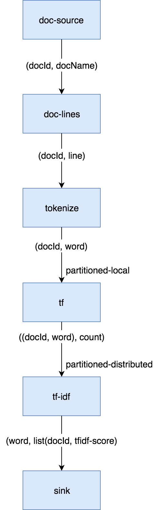
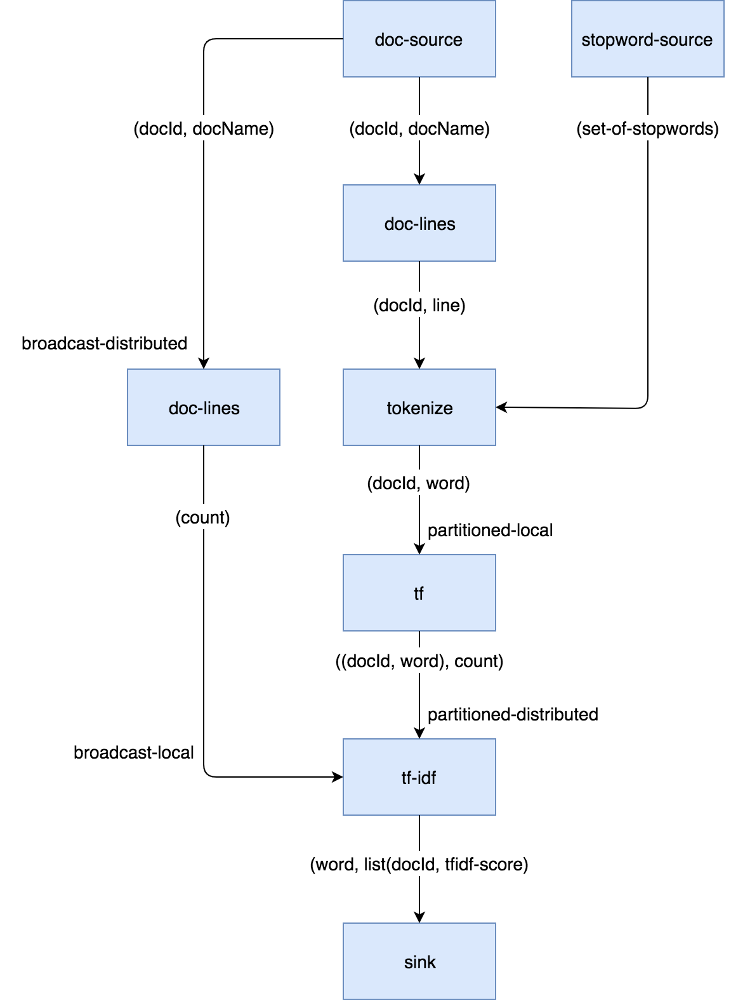

In this tutorial we'll explore what the Core API DAG model offers beyond
the capabilities of the Pipeline API. Our DAG will feature splits, joins,
broadcast, and prioritized edges. We'll access data from the file system
and show a simple technique to distribute file reading across Jet
members. Several vertices we use can't be implemented in terms of
out-of-the-box processors, so we'll also show you how to implement your
own with minimum boilerplate.

The full code is available at the `hazelcast-jet-code-samples`
repository:

[TfIdfJdkStreams.java](https://github.com/hazelcast/hazelcast-jet-code-samples/blob/master/batch/tf-idf/src/main/java/TfIdfJdkStreams.java)

[TfIdf.java](https://github.com/hazelcast/hazelcast-jet-code-samples/blob/master/batch/tf-idf/src/main/java/TfIdf.java)

Let us first introduce the problem. The inverted index is a basic data 
structure in the domain of full-text search. First used in the 1950s, it
is still at the core of modern information retrieval systems such as
Lucene. The goal is to be able to quickly find the documents that
contain a given set of search terms, and to sort them by relevance. To
understand it we'll need to throw in some terminology...

- A _document_ is treated as a list of words that has a unique ID. It is
useful to define the notion of a _document index_ which maps each
document ID to the list of words it contains. We won't build this index;
it's just for the sake of explanation.
- The _inverted index_ is the inverse of the document index: it maps
each word to the list of documents that contain it. This is the
fundamental building block in our search algorithm: it will allow us to
find in O(1) time all documents relevant to a search term.
- In the inverted index, each entry in the list is assigned a _TF-IDF
score_ which quantifies how relevant the document is to the search
request.
    - Let DF (_document frequency_) be the length of the list: the
    number of documents that contain the word.
    - Let D be the total number of documents that were indexed.
    - IDF (_inverse document frequency_) is equal to `log(D/DF)`.
    - TF (_term frequency_) is the number of occurrences of the word in
    the document.
    - TF-IDF score is simply the product of `TF * IDF`.

Note that IDF is a property of the word itself: it quantifies the
relevance of each entered word to the search request as a whole. The
list of entered words can be perceived as a list of filtering functions
that we apply to the full set of documents. A more relevant word will
apply a stronger filter. Specifically, common words like "the", "it",
"on" act as pure "pass-through" filters and consequently have an IDF of
zero, making them completely irrelevant to the search.

TF, on the other hand, is the property of the combination of word and
document, and tells us how relevant the document is to the word,
regardless of the relevance of the word itself.

When the user enters a search phrase:

1. each individual term from the phrase is looked up in the inverted
index;
2. an intersection is found of all the lists, resulting in the list of
documents that contain all the words;
3. each document is scored by summing the TF-IDF contributions of each
word;
4. the result list is sorted by score (descending) and presented to the
user.

Let's have a look at a specific search phrase:

```text
the man in the black suit murdered the king
```

The list of documents that contain all the above words is quite long...
how do we decide which are the most relevant? The TF-IDF logic will make
those stand out that have an above-average occurrence of words that are
generally rare across all documents. For example, "murdered" occurs in
far fewer documents than "black"... so given two documents where one has
the same number of "murdered" as the other one has of "black", the one
with "murdered" wins because its word is more salient in general. On the
other hand, "suit" and "king" might have a similar IDF, so the document
that simply contains more of both wins.

Also note the limitation of this technique: a phrase is treated as just
the sum of its parts; a document may contain the exact phrase and this
will not affect its score.

## Building the Inverted Index with Java Streams

To warm us up, let's see what it takes to build the inverted index with
just thread parallelism and without the ability to scale out across
many machines. It is expressible in Java Streams API without too much
work. The full code is [here](https://github.com/hazelcast/hazelcast-jet-code-samples/blob/master/batch/tf-idf/src/main/java/TfIdfJdkStreams.java).

We'll start by preparing a `Stream<Entry<Long, String>> docWords`: a
stream of all the words found in all the documents. We use `Map.Entry` as
a holder of a pair of values (a 2-tuple) and here we have a pair of
`Long docId` and `String word`:


```java
Stream<Entry<Long, String>> docWords = docId2Name
        .entrySet()
        .parallelStream()
        .flatMap(TfIdfJdkStreams::docLines)
        .flatMap(this::tokenize);
```

We know the number of all documents so we can compute `double 
logDocCount`, the logarithm of the document count:

```java
double logDocCount = Math.log(docId2Name.size());
```

Calculating TF is very easy, just count the number of occurrences of
each distinct pair and save the result in a `Map<Entry<Long, String>,
Long>`:

```java
// TF map: (docId, word) -> count
final Map<Entry<Long, String>, Long> tfMap = docWords
        .parallel()
        .collect(groupingBy(identity(), counting()));
```

And now we build the inverted index. We start from `tfMap`, group by
word, and the list under each word already matches our final product:
the list of all the documents containing the word. We finish off by
applying a transformation to the list: currently it's just the raw
entries from the `tf` map, but we need pairs `(docId, tfIDfScore)`.

```java
invertedIndex = tfMap
    .entrySet() // set of ((docId, word), count)
    .parallelStream()
    .collect(groupingBy(
        e -> e.getKey().getValue(),
        collectingAndThen(
            toList(),
            entries -> {
                double idf = logDocCount - Math.log(entries.size());
                return entries.stream()
                              .map(e -> tfidfEntry(e, idf))
                              .collect(toList());
            }
        )
    ));

// ((docId, word), count) -> (docId, tfIdf)
private static Entry<Long, Double> tfidfEntry(
        Entry<Entry<Long, String>, Long> tfEntry, Double idf
) {
    final Long tf = tfEntry.getValue();
    return entry(tfEntry.getKey().getKey(), tf * idf);
}
```

The search function can be implemented with another Streams expression,
which you can review in the [SearchGui](
https://github.com/hazelcast/hazelcast-jet-code-samples/blob/master/batch/tf-idf/src/main/java/SearchGui.java)
class. You can also run the [TfIdfJdkStreams](
https://github.com/hazelcast/hazelcast-jet-code-samples/blob/master/batch/tf-idf/src/main/java/TfIdfJdkStreams.java)
class and take the inverted index for a spin, making actual searches.

There is one last concept in this model that we haven't mentioned yet:
the _stopword set_. It contains those words that are known in advance to
be common enough to occur in every document. Without treatment, these
words are the worst case for the inverted index: the document list under
each such word is the longest possible, and the score of all documents
is zero due to zero IDF. They raise the index's memory footprint without
providing any value. The cure is to prepare a file, `stopwords.txt`,
which is read in advance into a `Set<String>` and used to filter out the
words in the tokenization phase. The same set is used to cross out words
from the user's search phrase, as if they weren't entered. We'll add this
feature to our DAG based model in the following section.

## Translating to Jet DAG

Our DAG as a whole will look relatively complex, but it can be
understood as a "backbone" (cascade of vertices) starting from a source
and ending in a sink with several more vertices attached on the side.
This is just the backbone:



1. The data source is a Hazelcast `IMap` which holds a mapping from
document ID to its filename. The source vertex will emit all the map's
entries, but only a subset on each cluster member.
1. `doc-lines` opens each file named by the map entry and emits all its
lines in the `(docId, line)` format.
1. `tokenize` transforms each line into a sequence of its words, again
paired with the document ID, so it emits `(docId, word)`.
1. `tf` builds a set of all distinct pairs emitted from `tokenize` and maintains the count of each pair's occurrences (its TF score).
1. `tf-idf` takes that set, groups the pairs by word, and calculates
the TF-IDF scores. It emits the results to the sink, which saves them
to a distributed `IMap`.

Edge types follow the same pattern as in the word-counting job: after
flatmapping there is first a local, then a distributed partitioned edge.
The logic behind it is not the same, though: TF can actually compute the
final TF scores by observing just the local data. This is because it
treats each document separately (document ID is a part of the grouping
key) and the source data is already partitioned by document ID. The
TF-IDF vertex does something similar to word count's combining, but
there's again a twist: it will group the TF entries by word, but instead
of just merging them into a single result per word, it will keep them
all in lists.

To this cascade we add a `stopword-source` which reads the stopwords
file, parses it into a `HashSet`, and sends the whole set as a single
item to the `tokenize` vertex. We also add a vertex that takes the data
from `doc-source` and simply counts its items; this is the total
document count used in the TF-IDF formula. We end up with this DAG:




The choice of edge types into and out of `doc-count` may look surprising,
so let's examine it. We start with the `doc-source` vertex, which emits
one item per document, but its output is distributed across the cluster.
To get the full document count on each member, each `doc-count`
processor must get all the items, and that's just what the distributed
broadcast edge will achieve. We'll configure `doc-count` with local
parallelism of 1, so there will be one processor on every member, each
observing all the `doc-source` items. The output of `doc-count` must
reach all `tf-idf` processors on the same member, so we use the local
broadcast edge.

Another thing to note are the two flat-mapping vertices: `doc-lines` and
`tokenize`. From a purely semantic standpoint, composing flatmap with
flatmap yields just another flatmap. As we'll see below, we're using
custom code for these two processors... so why did we choose to separate
the logic this way? There are actually two good reasons. The first one
has to do with Jet's cooperative multithreading model: `doc-lines` makes
blocking file IO calls, so it must be declared _non-cooperative_;
tokenization is pure computation so it can be in a _cooperative_
processor. The second one is more general: the workload of `doc-lines`
is very uneven. It consists of waiting, then suddenly coming up with a
whole block of data. If we left tokenization there, performance would
suffer because first the CPU would be forced to sit idle, then we'd be
late in making the next IO call while tokenizing the input. The separate
vertex can proceed at full speed all the time.

## Implementation Code

As we announced, some of the processors in our DAG will need custom
implementation code. Let's start from the source vertex. It is easy,
just the standard `IMap` reader:

```java
dag.newVertex("doc-source", Processors.readMap(DOCID_NAME));
```

The stopwords-producing processor has custom code, but it's quite
simple:

```java
dag.newVertex("stopword-source", StopwordsP::new);
```

```java
private static class StopwordsP extends AbstractProcessor {
    @Override
    public boolean complete() {
        return tryEmit(docLines("stopwords.txt").collect(toSet()));
    }
}
```

Since this is a source processor, all its action happens in
`complete()`. It emits a single item: the `HashSet` built directly from
the text file's lines.

The `doc-count` processor can be built from the primitives provided in
Jet's library:

```java
dag.newVertex("doc-count", Processors.aggregate(counting()));
```

The `doc-lines` processor is more of a mouthful, but still built from
existing primitives:

```java
dag.newVertex("doc-lines",
    Processors.nonCooperative(
        Processors.flatMap((Entry<Long, String> e) ->
            traverseStream(docLines("books/" + e.getValue())
                           .map(line -> entry(e.getKey(), line))))));
```

Let's break down this expression... `Processors.flatMap` returns a
standard processor that emits an arbitrary number of items for each
received item. We already saw one in the introductory Word Count
example. There we created a traverser from an array, here we create it
from a Java stream. We additionally apply the `nonCooperative()` wrapper
which will declare all the created processors non-cooperative. We
already explained why we do this: this processor will make blocking I/O
calls.

`tokenizer` is another custom vertex:

```java
dag.newVertex("tokenize", TokenizeP::new);

private static class TokenizeP extends AbstractProcessor {
    private Set<String> stopwords;
    private final FlatMapper<Entry<Long, String>, Entry<Long, String>> flatMapper =
        flatMapper(e -> traverseStream(
                   Arrays.stream(DELIMITER.split(e.getValue()))
                         .filter(word -> !stopwords.contains(word))
                         .map(word -> entry(e.getKey(), word))));

    @Override
    protected boolean tryProcess0(@Nonnull Object item) {
        stopwords = (Set<String>) item;
        return true;
    }

    @Override
    protected boolean tryProcess1(@Nonnull Object item) {
        return flatMapper.tryProcess((Entry<Long, String>) item);
    }
}
```

This is a processor that must deal with two different inbound edges. It
receives the stopword set over edge 0 and then it does a flatmapping
operation on edge 1. The logic presented here uses the same approach as
the implementation of the provided `Processors.flatMap()` processor:
there is a single instance of `FlatMapper` that holds the business logic
of the transformation, and `tryProcess1()` directly delegates into it.
If `FlatMapper` is done emitting the previous items, it will accept the
new item, apply the user-provided transformation, and start emitting the
output items. If the outbox refuses a pending item, it will return
`false`, which will make the framework call the same `tryProcess1()`
method later, with the same input item.

Let's show the code that creates the `tokenize`'s two inbound edges:

```java
dag.edge(between(stopwordSource, tokenize).broadcast().priority(-1))
   .edge(from(docLines).to(tokenize, 1));
```

Especially note the `.priority(-1)` part: this ensures that there will
be no attempt to deliver any data coming from `docLines` before all the
data from `stopwordSource` is already delivered. The processor would
fail if it had to tokenize a line before it has its stopword set in
place.

`tf` is another simple vertex, built purely from the provided
primitives:

```java
dag.newVertex("tf", Processors.aggregateByKey(wholeItem(), counting()));
```

`tf-idf` is the most complex processor:

```java
dag.newVertex("tf-idf", TfIdfP::new);

private static class TfIdfP extends AbstractProcessor {
    private double logDocCount;

    private final Map<String, List<Entry<Long, Double>>> wordDocTf = new HashMap<>();
    private final Traverser<Entry<String, List<Entry<Long, Double>>>> invertedIndexTraverser =
            lazy(() -> traverseIterable(wordDocTf.entrySet()).map(this::toInvertedIndexEntry));

    @Override
    protected boolean tryProcess0(@Nonnull Object item) throws Exception {
        logDocCount = Math.log((Long) item);
        return true;
    }

    @Override
    protected boolean tryProcess1(@Nonnull Object item) throws Exception {
        final Entry<Entry<Long, String>, Long> e = (Entry<Entry<Long, String>, Long>) item;
        final long docId = e.getKey().getKey();
        final String word = e.getKey().getValue();
        final long tf = e.getValue();
        wordDocTf.computeIfAbsent(word, w -> new ArrayList<>())
                 .add(entry(docId, (double) tf));
        return true;
    }

    @Override
    public boolean complete() {
        return emitFromTraverser(invertedIndexTraverser);
    }

    private Entry<String, List<Entry<Long, Double>>> toInvertedIndexEntry(
            Entry<String, List<Entry<Long, Double>>> wordDocTf
    ) {
        final String word = wordDocTf.getKey();
        final List<Entry<Long, Double>> docidTfs = wordDocTf.getValue();
        return entry(word, docScores(docidTfs));
    }

    private List<Entry<Long, Double>> docScores(List<Entry<Long, Double>> docidTfs) {
        final double logDf = Math.log(docidTfs.size());
        return docidTfs.stream()
                       .map(tfe -> tfidfEntry(logDf, tfe))
                       .collect(toList());
    }

    private Entry<Long, Double> tfidfEntry(double logDf, Entry<Long, Double> docidTf) {
        final Long docId = docidTf.getKey();
        final double tf = docidTf.getValue();
        final double idf = logDocCount - logDf;
        return entry(docId, tf * idf);
    }
}
```

This is quite a lot of code, but each of the three pieces is not too
difficult to follow:

1. `tryProcess0()` accepts a single item, the total document count.
1. `tryProcess1()` performs a boilerplate `groupBy` operation,
collecting a list of items under each key.
1. `complete()` outputs the accumulated results, also applying the
final transformation on each one: replacing the TF score with the final
TF-IDF score. It relies on a _lazy_ traverser, which holds a
`Supplier<Traverser>` and will obtain the inner traverser from it the
first time `next()` is called. This makes it very simple to write code
that obtains a traverser from a map after it has been populated.

Finally, our DAG is terminated by a sink vertex:

```java
dag.newVertex("sink", Processors.writeMap(INVERTED_INDEX));
```

