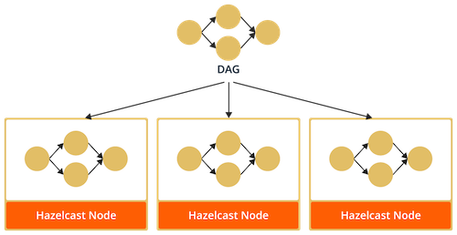
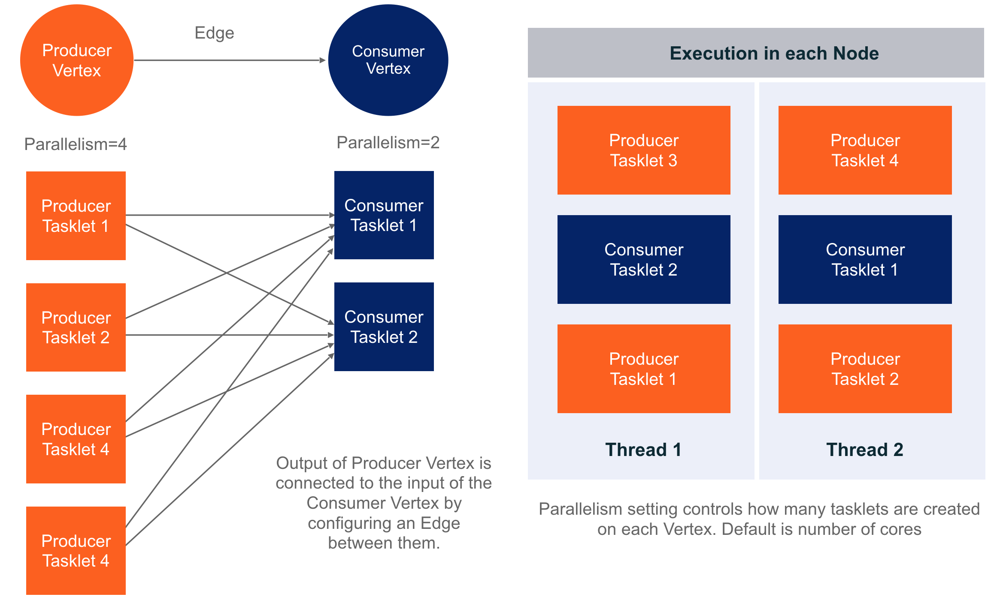

# Overview of Jet's Architecture

## What is Hazelcast Jet

Hazelcast Jet is a distributed computing platform for fast processing of
data. With Hazelcast’s IMDG providing storage functionality,
Hazelcast Jet performs parallel execution to enable data-intensive
applications to operate in near real-time. Using directed acyclic graphs
(DAG) to model relationships between individual steps in the data
processing pipeline, Hazelcast Jet can execute both batch and
stream-based data processing applications. Jet handles the parallel
execution using the green thread approach to optimize the utilization of
the computing resources.

The breakthrough application speed is achieved by keeping both the
computation and data storage in memory. The embedded Hazelcast IMDG
provides elastic in-memory storage and is a great tool for storing
the results of a computation or as a cache for datasets to be used
during the computation. Extremely low end-to-end latencies can be
achieved this way.

It is extremely simple to use - in particular Jet can be fully embedded
for OEMs and for Microservices – making it is easier for manufacturers
to build and maintain next generation systems. Also, Jet uses Hazelcast
discovery for finding the members in the cluster, which can be used in
both on-premise and cloud environments.

## Architecture Overview


At the core of Jet is the distributed computation engine based on the
paradigm of a _directed acyclic graph_ (DAG). In this graph, vertices
are units of data processing and edges are units of data routing and
transfer.


A `Vertex` represents a step of data processing. Each Vertex has one
more or `Processor` instances which do the data processing for that
vertex. The `Processor` is the smallest unit of computation. Processor
code is user implemented, and several vertices might use the same
Processor type. There might be several instances of the Processor
running in parallel for a single vertex, which is configured by the
parallelism attribute.

Both data sources and sinks are implemented as `Processor`s and are
typically  found in the terminal ends of the DAG. Data sources and sinks
can be partitioned, meaning that the supplied data is partitioned across
the cluster, with each instance of a vertex receiving a partition of the
data. Examples sources are HDFS files, Hazelcast `IMap` or `IList`.

`Edges` transfer data between one vertex to another and have properties
which determine how data is transferred between the input and output
vertices.

After a `Job` is created, the DAG is replicated to the whole Hazelcast
cluster and executed on each node individually.



Execution is done on a user-configurable number of threads which use
work stealing to balance the amount of work being done on each thread.
Each worker thread has a queue of tasklets, and enqueued tasklets are
moved between queues as the workers drain their queues at different
rates.

Each instance of a `Processor` is mapped to one tasklet which is
repeatedly executed until it exhausts its input. A vertex with a
parallelism of 8 running on 4 nodes would have a total of 32 tasklets
running at the same time. Each node will have the same number of
tasklets running.



When a request to execute a Job is made, the corresponding DAG and
additional resources are deployed to the whole of the Jet cluster.
An execution plan for the DAG is built on each node, which creates the
associated tasks for each Vertex and connects these tasks with their
inputs and outputs.

Data between vertices are transferred over local ringbuffers. Jet is
data-type agnostic, so any data type could be used for transferring data
between vertices.

Ringbuffers, being bounded queues, introduce natural backpressure into
the system; if a consumer’s ringbuffer is full, the producer will have
to block until it can enqueue the next item. The adaptive recieve
windows are used to control the data flow and to handle a back pressure
over the wire.  

## Job

A Job is the unit of work which is executed. A Job is described by a
DAG, which describes the computation to be performed, and the inputs and
outputs of the computation.

`Job` is a handle to the execution of a `DAG`. To create a job,
supply the `DAG` to a previously created `JetInstance`:

```java
JetInstance jet = Jet.newJetInstance(); // or Jet.newJetClient();
DAG dag = new DAG();
dag.newVertex(..);
jet.newJob(dag).execute().get();
```

As hinted in the code example, the job submission API is identical
whether you use it from a client machine or directly on an instance of a
Jet cluster member. This works because the `Job` instance is
serializable and the client can send it over the network when submitting
the job. The same `Job` instance can be submitted for execution many
times.

Job execution is asynchronous. The `execute()` call returns as soon as
the Jet cluster has been contacted and the serialized job sent to it.
The user gets a `Future` which can be inspected or waited on to find out
the outcome of a computation job. It is also cancelable and can send a
cancelation command to the Jet cluster.

The `Future` only signals the status of the job, it doesn't contain the
result of the computation. The DAG explicitly models the storing of
results via its _sink_ vertices. Typically the results will be in a
Hazelcast map or another structure and have to be accessed by their own
API after the job is done.

## Vertex

Vertex is the main unit of work in a Jet computation. Conceptually, it
receives input from its inbound edges and emits data to its outbound
edges. Practically, it is a number of `Processor` instances which
receive each its own part of the full stream traveling over the inbound
edges, and likewise emits its own part of the full stream going down
the outbound edges.

### Edge ordinal

An edge is connected to a vertex with a given _ordinal_, which
identifies it to the vertex and its processors. When a processor
receives an item, it knows the ordinal of the edge on which the item
came in. Things are similar on the outbound side: the processor emits an
item to a given ordinal, but also has the option to emit the same item
to all ordinals. This is the most typical case and allows easy
replication of a data stream across several edges.

### Source and sink

Jet uses only one kind of vertex, but in practice there is an important
distinction between:

* _internal_ vertex which accepts input and transforms it into output;
* _source_ vertex which generates output without receiving anything;
* _sink_ vertex which consumes input and doesn't emit anything.

Sources and sinks must interact with the environment to store/load data,
making their implementation more involved compared to the internal
vertices, whose logic is self-contained.

### Local and Global Parallelism

The vertex is implemented by one or more instances of `Processor` on
each member. Each vertex can specify how many of its processors will run
per cluster member using the `localParallelism` property; every member
will have the same number of processors.

## Processor

`Processors` are the basic unit of computation in the data processing
pipeline. The data processing pipeline is built by linking various
processors.

`Processor` is the main type whose implementation is up to the user: it
contains the code of the computation to be performed by a vertex. There
are a number of Processor building blocks in the Jet API which allow the
user to just specify the computation logic, while the provided code
handles the processor's cooperative behavior. Refer to the section on
[AbstractProcessor](#abstractprocessor) below.

A processor's work can be conceptually described as follows: "receive
data from zero or more input streams and emit data into zero or more
output streams." Each stream maps to a single DAG edge (either inbound
or outbound). There is no requirement on the correspondence between
input and output items; a processor can emit any data it sees fit,
including none at all. The same `Processor` abstraction is used for all
kinds of vertices, including sources and sinks.

## Job Execution

After a Job is created, the DAG is replicated to the whole Jet
cluster and executed on each node individually. At the core of the
Jet engine is the `ExecutionService`. This is the component that drives
the cooperatively-multithreaded execution of Processors as well as
other vital components, like network senders and receivers.

### Job Initialization

These are the steps taken to create and initialize a Jet job:

1. User builds the DAG and submits it to the local Jet client instance.
1. The client instance serializes the DAG and sends it to a member of the Jet cluster. This member becomes the coordinator for this Jet job.
1. Coordinator deserializes the DAG and builds an execution plan for each member.
1. Coordinator serializes the execution plans and distributes each to its target member.
1. Each member acts upon its execution plan by creating all the needed tasklets, concurrent queues, network senders/receivers, etc.
1. Coordinator sends the signal to all members to start job execution.

The most visible consequence of the above process is the
ProcessorMetaSupplier type: the user must provide one for each Vertex.
In step 3 the coordinator deserializes the meta-supplier as a
constituent of the DAG and asks it to create ProcessorSupplier instances
which go into the execution plans. A separate instance of
ProcessorSupplier is created specifically for each member's plan. In
step 4 the coordinator serializes these and sends each to its member. In
step 5 each member deserializes its ProcessorSupplier and asks it to
create as many Processor instances as configured by the vertex's
localParallelism property.

This process is so involved because each Processor instance may need to
be differently configured. This is especially relevant for processors
driving a source vertex: typically each one will emit only a slice of
the total data stream, as appropriate to the partitions it is in charge
of.

### Tasklet

The execution service maintains a pool of worker threads, each of which
juggles several "green threads" captured by an abstraction called the
`Tasklet`. Each tasklet is given its turn and after it tries to do some
work, it returns two bits of information: whether it made any progress
and whether it is now done. As the worker cycles through its tasklets,
before each new new cycle it checks whether any tasklet made progress;
if not, it bumps its counter of idle cycles and acts according to the
current count: either try again or sleep for a while.

#### Work stealing

When a tasklet is done, the worker removes it from its tasklet pool.
Workers start out with tasklets evenly distributed among them, but as
the tasklets complete, the load on each worker may become imbalanced. To
counter this, a simple _work stealing_ mechanism is put into place: each
time it removes a tasklet from its pool, the worker (let's call it
"thief") will inspect all the other workers, locating the one with the
largest pool (call it "target"). If the thief finds a target with at
least two tasklets more, it will pick one of the target's tasklets and
mark it with the instruction "give this one to me". When the target is
about to run the marked tasklet, it will observe the instruction and
move the tasklet to the thief's pool. The whole interaction takes place
in a lock-free manner.

### ProcessorTasklet

`ProcessorTasklet` wraps a single processor instance and does the
following:

- drain the incoming concurrent queues into the processor's `Inbox`;
- let it process the inbox and fill its `Outbox`;
- drain the outbox into the outgoing concurrent queues;
- make sure that all of the above conforms to the requirements of
cooperative multithreading, e.g., yielding to other tasklets whenever an
outgoing queue is full.

### SenderTasklet and ReceiverTasklet

On each member a distributed DAG edge is implemented with one
`ReceiverTasklet` and as many `SenderTasklet`s as there are target
members (cluster size minus one). Jet reuses Hazelcast's networking
layer and adds its own type of `Packet`, which can contain several data
items traveling over a single edge. The packet size limit is
configurable; to minimize fixed overheads from packet handling, Jet will
try to stuff as many items as can fit into a single packet. It will keep
adding items until it notices the limit is reached, which means that the
actual packet size can exceed the limit by the size of one item.

### Network backpressure

A key concern in edge data transfer is _backpressure_: the downstream
vertex may not be able to process the items at the same rate as the
upstream vertex is emitting them. Within a member the concurrent queues
are bounded and naturally provide backpressure by refusing to accept an
item when full. However, over the network no such natural mechanism
exists, especially because the same TCP/IP connectionn is used for all
edges so TCP's own flow control mechanism is not sufficient to guard
an individual edge's limits. For that reason Jet introduces its own
flow-control mechanism based on the _adaptive receive window_.

Each member sends out flow-control packets (_ack packets_ for short) to
all other members at regular intervals, detailing to each individual
`SenderTasklet` how much more data it is allowed to send. A
`ReceiverTasklet` keeps track of how much data received from each member
it processed since the last sending of the ack packet. It uses this to
calculate the current rate of data processing, which then guides the
adaptive sizing of the receive window. The target size for the window is
determined before sending an ack packet: it is three times the data
processed since the last sending of the ack packet, and the receive
window is adjusted from the current size halfway towards the target
size.

## Edge

An edge represents a link between two vertices in the DAG. Conceptually,
data flows between two vertices along an edge; practically, each
processor of the upstream vertex contributes to the overall data stream
over the edge and each processor of the downstream vertex receives a
part of that stream. Several properties of the `Edge` control the
routing from upstream to downstream processors.

For any given pair of vertices, there can be at most one edge between
them.

### Priority

By default the processor receives items from all inbound edges as they
arrive; however, there are important cases where the reception of one
edge must be delayed until all other edges are consumed in full. A major
example is a join operation. Collating items from several edges by a
common key implies buffering the data from all edges except one before
emitting any results. Often there is one edge with much more data than
the others and this one doesn't need to be buffered if all the other
data is ready.

Edge consumption order is controlled by the _priority_ property. Edges
are sorted by their priority number (ascending) and consumed in that
order. Edges with the same priority are consumed without particular
ordering (as the data arrives).

### Local vs. distributed edge

A major choice to make in terms of data routing is whether the candidate
set of target processors is unconstrained, encompassing all processors
across the cluster, or constrained to just those running on the same
cluster member. This is controlled by the `distributed` property of the
edge. By default the edge is local and calling the `distributed()`
method removes this restriction.

With appropriate DAG design, network traffic can be minimized by
employing local edges. Local edges are implemented
with the most efficient kind of concurrent queue: single-producer,
single-consumer bounded queue. It employs wait-free algorithms on both
sides and avoids `volatile` writes by using `lazySet`.

### Partitioned edge

A partitiond edge sends each item to the one processor responsible for
the item's partition ID. On a distributed edge, this processor will be
unique across the whole cluster. On a local edge, each member will have
its own processor for each partition ID.

Calculating the item's partition ID is a major concern because the
result must be repeatable across all cluster members, which may be
running on disparate JVM implementations. By default, Hazelcast's
standard partitioning scheme is used. It is safe but CPU-intensive.
Java's standard `Object.hashCode()` is also an option, but its contract
doesn't require repeatability outside a single running JVM instance.

## Using Hazelcast Jet

There are two ways to use Jet: build the DAG using the Core API use the java.util.stream as a high-level API. The java.util.stream operations are mapped to a DAG and then executed, and the result returned to the user.

java.util.stream provides more convenience, the Core API exposese all the potential of Jet.

There are plans for developing higher level batching and streaming APIs.

### Core API

In order to run the Jet Job user has to build the DAG and submit it to the local Jet instance. That means implementing the Processors and connecting them together using Edges.

There is a convenience API to implement a Processor.

#### AbstractProcessor

`AbstractProcessor` is a convenience class designed to deal with most of
the boilerplate in implementing the full `Processor` API.

The first line of convenience are the `tryProcessN()` methods which
receive one item at a time, thus eliminating the need to write a
suspendable loop over the input items. There is a separate method
specialized for each edge from 0 to 4 (`tryProcess0`..`tryProcess4`) and
there is a catch-all method `tryProcessAny(ordinal, item)`. If the
processor doesn't need to distinguish between inbound edges, the latter
method is a good match; otherwise it is simpler to implement one or more
of the ordinal-specific methods. The catch-all method is also the only
way to access inbound edges beyond ordinal 4, but such cases are very
rare in practice.

A major complication arises from the requirement to observe the outbox
limits during a single processing step. If the processor emits many
items per step, the loop doing this must support being suspended at any
point and resumed later. This need arises in two typical cases:

- when a single input item maps to a multitude of output items;
- when items are emitted in the final step, after having received all
the input.

`AbstractProcessor` provides the method `emitCooperatively` to support
the latter and there is additional support for the former with the
nested class `FlatMapper`. These work with the `Traverser` abstraction
to cooperatively emit a user-provided sequence of items.

#### Traverser

`Traverser` is a very simple functional interface whose shape matches
that of a `Supplier`, but with a contract specialized for the traversal
over a sequence of non-null items: each call to its `next()` method
returns another item of the sequence until exhausted, then keeps
returning `null`. The point of this type is the ability to implement
traversal over any kind of dataset or lazy sequence with minimum hassle:
often just by providing a one-liner lambda expression. This makes it
very easy to integrate into Jet's convenience APIs for cooperative
processors.

`Traverser` also sports some `default` methods that facilitate building
a simple transformation layer over the underlying sequence: `map`,
`filter`, and `flatMap`.

#### Simple example

This is how a simple flatmapping processor would be implemented:

```java
public class ItemAndSuccessorP extends AbstractProcessor {
    private final FlatMapper<Integer, Integer> flatMapper =
        flatMapper(i -> traverseIterable(asList(i, i + 1)));

    @Override
    protected boolean tryProcess(int ordinal, Object item) {
        return flatMapper.tryProcess((int) item);
    }
}
```
For each received `Integer` item this processor emits the item and its
successor. It doesn't differentiate between inbound edges (treats data
from all edges the same way) and emits each item to all outbound edges
connected to its vertex.

This deceptively simple example takes care of suspending and resuming
iteration both between two items in the inbox and within a single inbox
item, between the two items to be emitted. This is why `flatMapper` is
an instance variable and not a local one: the iteration state stays
inside it when the tasklet returns control to the execution service.

#### `Processors` utility class

As a further layer of convenience there are some ready-made Processor
implementations. These are the broad categories:

1. Sources and sinks for Hazelcast `IMap` and `IList`.
2. Processors with `flatMap`-type logic, including `map`, `filter`, and
the most general `flatMap`.
3. Processors that perform a reduction operation after grouping items by
key. These come in two flavors:
    a. _Accumulate:_ reduce by transforming an immutable value;
    b. _Collect:_ reduce by updating a mutable result container.

#### Building the DAG

```java
JetConfig cfg = new JetConfig();
    cfg.setInstanceConfig(new InstanceConfig().setCooperativeThreadCount(
        Math.max(1, getRuntime().availableProcessors() / 2)));

Jet.newJetInstance(cfg);
JetInstance jet = Jet.newJetInstance(cfg);

DAG dag = new DAG();

final int limit = 15_485_864;
Vertex generator = dag.newVertex("number-generator", new NumberGeneratorMetaSupplier(limit));
Vertex primeChecker = dag.newVertex("filter-primes", Processors.filter(PrimeFinder::isPrime));
Vertex writer = dag.newVertex("writer", Processors.listWriter("primes"));

dag.edge(between(generator, primeChecker));
dag.edge(between(primeChecker, writer));

jet.newJob(dag).execute().get();

```

### java.util.stream

Besides the Core API, Jet also has an implementation of java.util.stream for Hazelcast IMap and IList. java.util.stream operations are mapped to a DAG and then executed, and the result returned to the user.

```java
IMap<String, Integer> ints = instance1.getMap("ints");
IStreamMap<String, Integer> map = IStreamMap.streamMap(ints);
int result = map.stream().map(m -> m.getValue()).reduce(0, (l, r) -> l + r);
```

## Integration with Hazelcast IMDG

As Jet is built on top of Hazelcast platform, there is a tight integration between Jet and IMDG. A Jet job is implemented as a Hazelcast IMDG proxy, similar to the other services and data structures in Hazelcast. The Hazelcast Operations are used for different actions that can be performed on a job. Jet can also be used with the Hazelcast Client, which uses the Hazelcast Open Binary Protocol to communicate different actions to the server instance.

### Reading from and Writing to Hazelcast Distributed Data Structures

Jet embedds Hazelcast IMDG. Therefore, Jet can use Hazelcast IMDG maps and lists on the embedded cluster as sources and sinks of data and make use of data locality. A Hazelcast IMap is distributed by partitions across a cluster and Jet nodes are able to efficiently read from the Map by having every node only read from their respective local partitions. ILists are always stored on a single partition, so when using an IList as a data source, all the data will be read on the node which contains the list.

When using maps and lists as a Sink, it is not possible to directly make use of data locality. If the emitted key value pair belongs to a non-local partition. In this case, the key value pair will be transmitted over the network to the node which owns that particular partition.

Apart from that, Jet can use any remote Hazelcast IMDG instance via Hazelcast IMDG connector.

## Deployment

### Discovery and Networking

Jet uses Hazelcast IMDG discovery for finding the members in the cluster.

On the wire Jet uses custom lightweight serialization for small and frequently used types (primitive types and strings) and delegates to Hazelcast serialization for the rest.

### Cloud deployment

Hazelcast Jet takes a benefit of the [Hazelcast Discovery SPI](http://docs.hazelcast.org/docs/latest/manual/html-single/index.html#discovery-spi) and [Cloud discovery plugins](https://hazelcast.org/plugins/?type=cloud-discovery) implementing this SPI to be deployed in various cloud environments.
